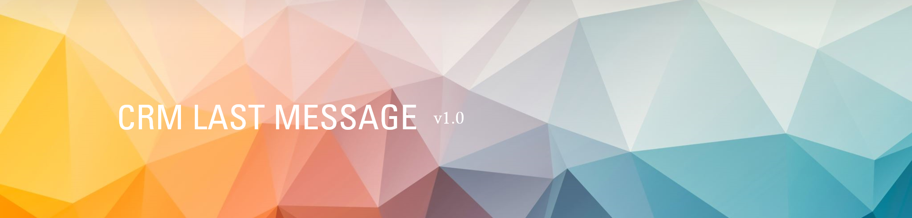

# CRM Last Message

# 📨 CRM Last Message — See Last Email in CRM Opportunities

Display the **latest message body** from your email thread directly on:
- ✅ CRM Opportunity Form
- ✅ CRM List (Kanban / Tree) View

A simple but powerful module to help your sales team **save time** and **stay informed** at a glance.

---

## 🌟 Features

- 📩 Shows the last incoming or outgoing message in HTML format
- 🧠 HTML converted to plain text in list view
- 🖥️ Form and list view enhancements
- 🐾 Compatible with Odoo 18.2
- 🔒 Clean, lightweight, no external dependencies

---

## 🛒 Purchase & Installation

This module is available **exclusively on the Odoo App Store**:

➡️ [Buy on Odoo Apps](https://apps.odoo.com/apps/modules/18.0/crm_last_message/)  
💵 **Price:** $19 (one-time)

After purchase:
1. Download the ZIP from your Odoo portal.
2. Install via **Apps > Import Module**.
3. Activate via the Apps dashboard.

🧑‍💻 Need help? Contact support via your Odoo.com account.

---

## 📸 Screenshots

---

## ⚖️ License

This module is licensed under the **LGPL-3** license.  
Commercial use is allowed under its terms.

> ❗This module is available as **paid software**. Unauthorized redistribution, resale, or uploading to third-party stores is a **violation of license terms** and may lead to legal consequences.

By purchasing the module via the Odoo App Store, you:
- Support ongoing development ❤️
- Encourage open source sustainability 🚀

---

## 🛠 Technical Details

| Field              | Value            |
|--------------------|------------------|
| Odoo Version       | 18.0             |
| Module Category    | CRM              |
| Dependencies       | crm              |
| License            | LGPL-3           |
| Maintainer         | Francisco Toro   |

---

## 👏 Acknowledgements

Made with ❤️ by Francisco Toro  
Need customizations? Contact us @ftc.odoo.test@gmail.com!

