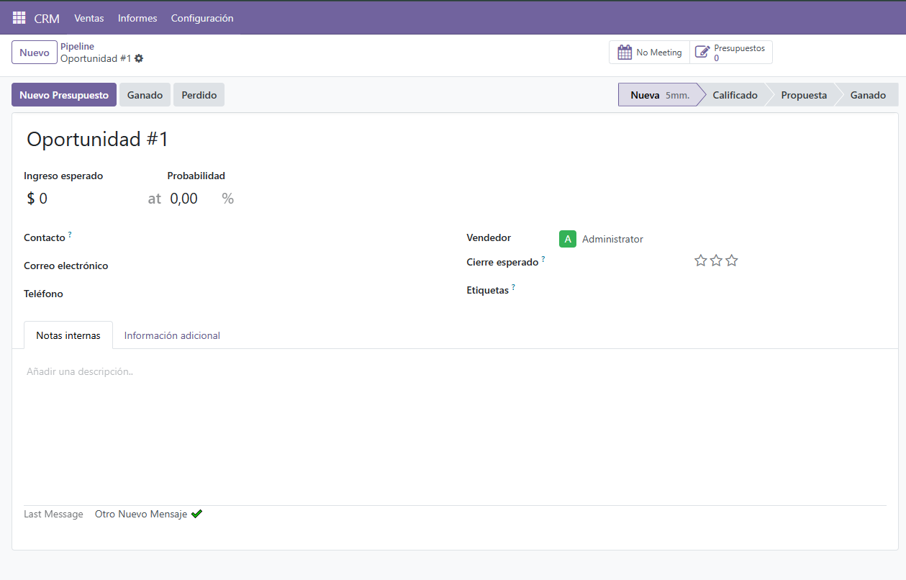
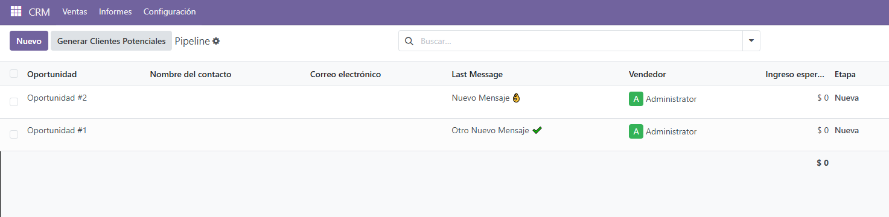

# CRM Last Message

This module adds a computed field to CRM Opportunities (`crm.lead`) that shows the **last message body**. It displays this field:

- On the **form view** with HTML formatting
- On the **tree/list view** as plain text (shortened)

## Features

✅ Show latest message in the chatter  
✅ Visible in list view (truncated plain text)  
✅ Fully installable on Odoo 17 and 18  
✅ Lightweight and non-intrusive

## Screenshots

*Form view:*

*List view:*

